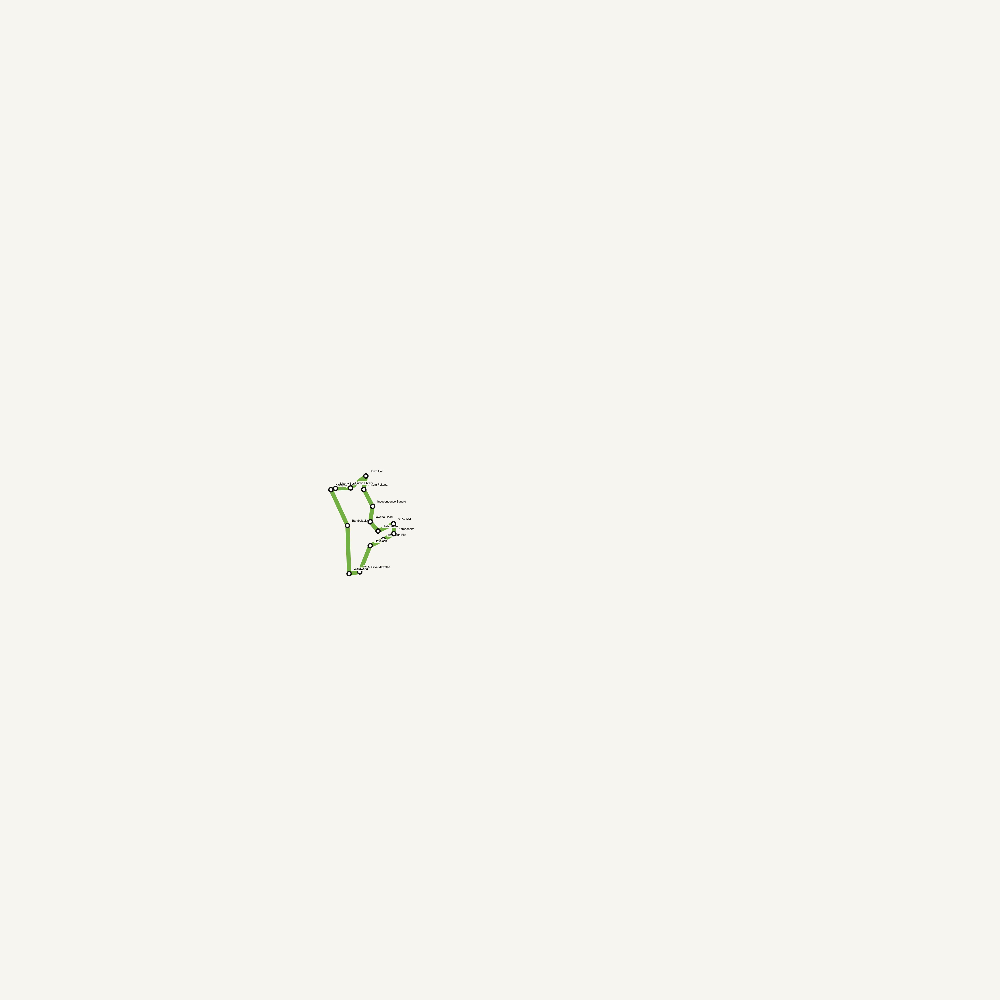
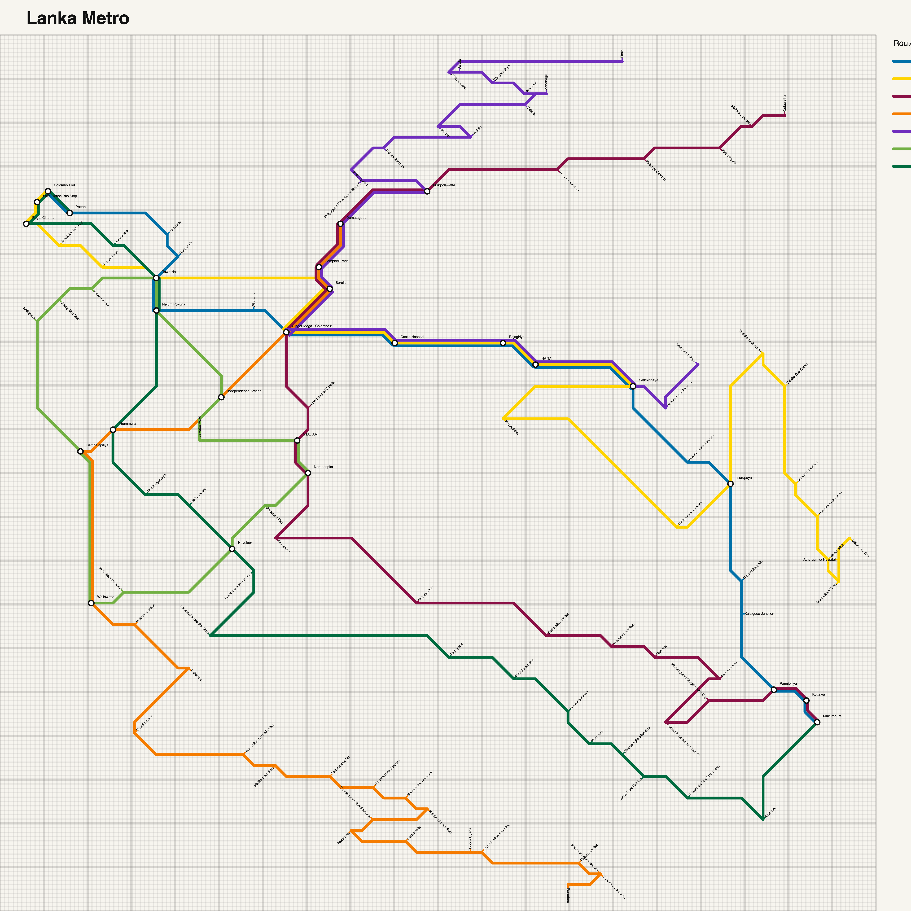
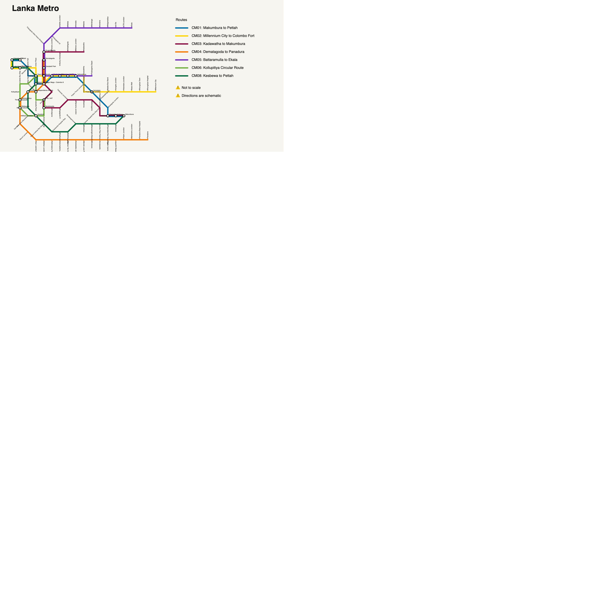

# Why Lanka Metro Needs a Diagram


A transit map has a different job from a street map. A street map answers questions about physical space: where a station is, how far apart two places are, and which direction a route travels. A transit map must answer a more immediate set of questions: which line should I take, where do I change, how many stops remain, and where does this service end?

The maps in this project explore that difference using the proposed Lanka Metro network. They begin with geographic truth, expose the problems that appear as the network becomes denser, and arrive at a Harry Beck-style diagram that deliberately trades physical accuracy for clarity.

## Geography First

The geographic map places every stop using its latitude and longitude. A Web Mercator projection converts those coordinates into a flat drawing, while a single uniform scale preserves the network's overall shape and orientation.



This view is valuable because it explains the system in relation to the city. Long north-south routes look long, nearby stops remain nearby, and the reader can recognize the broad footprint of the network. It is a useful planning map and an honest picture of where the infrastructure lies.

That honesty also creates a problem. Central Colombo contains many routes and stops in a comparatively small area, while the outer branches occupy much more space. Drawing both at the same geographic scale leaves a large part of the image visually quiet and compresses the part of the network where riders face the most choices. Labels, interchanges, and overlapping services must compete for limited room.

## Separating Shared Routes

The parallel geographic map addresses one source of ambiguity without abandoning geography. Routes that use the same corridor are offset from one another, curves are rounded, and labels are placed around the resulting paths. A shared section can therefore be read as several services rather than as one line hiding the others.



This is a substantial improvement. It reveals route identity, makes interchanges more explicit, and retains the recognizable shape of the city. But it cannot solve the deeper conflict: geography allocates space according to physical distance, while a passenger needs space allocated according to information density. The busiest part of the network is still the part with the least room to explain itself.

## The Case for a Harry Beck Map

Harry Beck's great insight in the 1930s was that an urban railway diagram should describe relationships rather than terrain. Riders generally do not need to know the precise angle or distance between two stations while travelling. They need an ordered sequence of stops and an unmistakable view of the available connections.

The Lanka Metro diagram follows that principle. Routes are reduced to horizontal, vertical, and 45-degree segments. Stops are distributed at regular intervals, shared corridors are separated, and interchange symbols are given enough space to remain legible. The centre can expand and the outskirts can contract because neither is constrained by geographic scale.



The result is less useful for judging distance, but much better for understanding the network as a system. Each route can be followed from end to end, changes are visible at a glance, and the dense centre no longer has to fit into its real-world footprint. The geographic maps remain important companions: they explain *where* the system is. The Beck-style map explains *how to use it*.

## How the Maps Are Built

The network data is stored as JSON in `data/`. Route records define each service, its color, and its ordered stops. Stop records provide geographic coordinates, while generated XY coordinates support the parallel layout.

The three renderers build progressively on one another:

- `GD` projects latitude and longitude with Web Mercator, scales the result into the drawing area, and renders routes, station ticks, interchanges, labels, title, and legend.
- `PGD` uses planar stop coordinates, offsets routes that share an edge, rounds corners with quadratic curves, and searches candidate positions to reduce label collisions.
- `HBD` reads the design in `data/harry_beck.json`. Compact direction sequences describe east, southeast, south, and the other five octilinear directions. These instructions are projected from known origin stops onto a regular grid; optional blank points allow bends between stations. The renderer also checks for non-octilinear edges, overlapping stops, position conflicts, and crossings without a shared interchange.

Every map is assembled as SVG, including its white background, route geometry, typography, logo, legend, description, and source note. The workflow then scales each SVG and rasterizes a 6000-pixel PNG for publication.

To regenerate the maps on macOS, install the Python dependencies and run:

```bash
pip install -r requirements.txt
python workflows/pipeline.py
```

The PNG and SVG outputs are written to `images/`.
